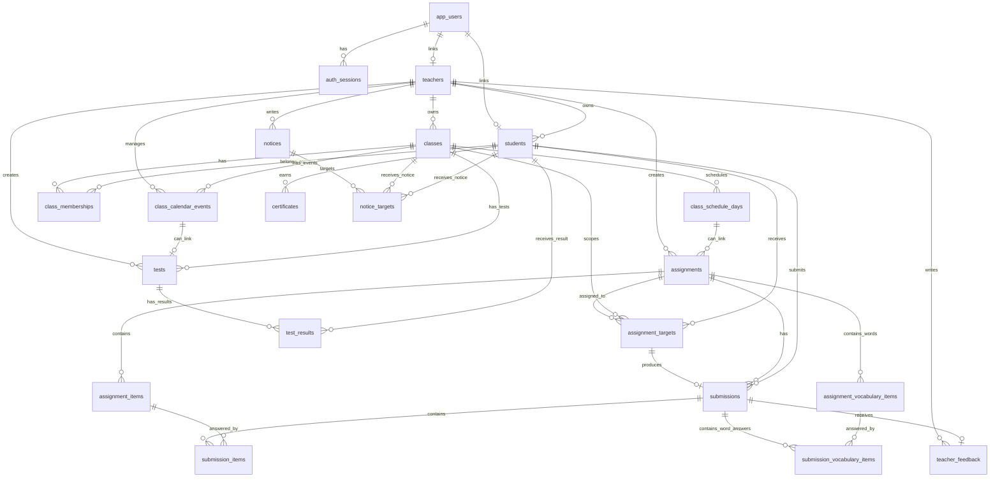

# DB ERD and Supabase Migration Guide

이 문서는 현재 프로젝트를 Next.js Route Handler + PostgreSQL + Supabase Storage 구조로 전환하면서 정리된 DB 설계와, 이후 Supabase로 안정적으로 마이그레이션하기 위한 기준 문서입니다.

## 1. 현재 구조 요약

- App: Next.js App Router
- DB: PostgreSQL
- File Storage: Supabase Storage
- Auth: 자체 로그인 + httpOnly cookie 세션
- Supabase Auth: 아직 사용하지 않음
- Teacher ID: 현재 개발 단계에서는 `teacher-1` mock 고정
- Student Login: `students.student_login_id + password_hash`
- 파일 업로드: Route Handler 내부에서만 Supabase Storage 접근

중요 원칙:

- Client Component에서 `supabase.from(...)` 직접 호출 금지
- Client Component에서 `storage.upload(...)` 직접 호출 금지
- 학생 API는 반드시 student session 기준으로 필터링
- 강사 API는 반드시 `teacher_id` 기준으로 필터링
- DB에는 파일 바이너리를 저장하지 않고 storage path와 metadata만 저장
- 비밀번호 평문 저장 금지, `password_hash`만 저장

## 2. ERD



## 3. 테이블 설계

### app_users

자체 로그인 계정 테이블입니다. 현재 강사 로그인과 학생 로그인 seed를 DB에 보관하기 위한 기반입니다.

주요 컬럼:

- `id uuid primary key`
- `username text unique not null`
- `password_hash text not null`
- `role text not null check in ('teacher', 'parent', 'student')`
- `display_name text not null`
- `linked_student_id text references students(id)`
- `created_at timestamptz default now()`
- `updated_at timestamptz default now()`

### auth_sessions

자체 auth session 저장 테이블입니다.

주요 컬럼:

- `id text primary key`
- `user_id uuid references app_users(id) on delete cascade`
- `expires_at timestamptz not null`
- `created_at timestamptz default now()`

### teachers

강사 계정의 기준 테이블입니다.

주요 컬럼:

- `id text primary key`
- `app_user_id uuid unique references app_users(id) on delete set null`
- `email text unique not null`
- `display_name text not null`
- `role text default 'teacher'`
- `created_at timestamptz default now()`
- `updated_at timestamptz default now()`

현재 개발 mock:

- `teacher-1`

### students

학생 로그인 정보와 학생 프로필을 저장합니다.

주요 컬럼:

- `id text primary key`
- `app_user_id uuid unique references app_users(id) on delete set null`
- `teacher_id text not null references teachers(id) on delete cascade`
- `student_login_id text not null`
- `password_hash text not null`
- `name text not null`
- `school_name text`
- `grade text`
- `avatar_key text default 'robot'`
- `memo text`
- `parent_id text`
- `status text default 'active' check in ('active', 'inactive')`
- `created_at timestamptz default now()`
- `updated_at timestamptz default now()`

제약:

- `unique (teacher_id, student_login_id)`

보안:

- 평문 비밀번호 저장 금지
- API 응답에 `password_hash` 포함 금지
- 학생 API에서는 `memo` 노출 금지

### classes

강사가 만든 반입니다. 학생 생성/수정 시 반 이름을 텍스트로 입력하지 않고 반드시 `classes` 중에서 선택합니다.

주요 컬럼:

- `id text primary key`
- `teacher_id text not null references teachers(id) on delete cascade`
- `name text not null`
- `description text`
- `status text default 'active' check in ('active', 'archived')`
- `created_at timestamptz default now()`
- `updated_at timestamptz default now()`

인덱스:

- `classes_teacher_name_unique on (teacher_id, lower(name))`

현재 UI/API:

- `GET /api/teacher/classes`
- `POST /api/teacher/classes`
- 반 관리 페이지에서 `반 만들기` 버튼으로 생성
- 반 카드는 3열 grid 기준이며, 나머지는 아래 줄로 내려감

### class_memberships

학생과 반의 N:M 연결 테이블입니다.

주요 컬럼:

- `id text primary key`
- `class_id text not null references classes(id) on delete cascade`
- `student_id text not null references students(id) on delete cascade`
- `created_at timestamptz default now()`

제약:

- `unique (class_id, student_id)`

원칙:

- 학생의 반 정보는 `students`에 텍스트로 저장하지 않음
- 학생 생성/수정 시 `classIds`를 받아 이 테이블을 갱신
- 현재 요구사항상 학생 생성 시 `classIds` 최소 1개 필요

### class_schedule_days

반 상세 페이지의 캘린더와 수업 진도 기록 기준 테이블입니다.

주요 컬럼:

- `id text primary key`
- `class_id text not null references classes(id) on delete cascade`
- `date date not null`
- `has_class boolean default true`
- `start_time time`
- `end_time time`
- `book_title text`
- `progress_title text`
- `progress_memo text`
- `next_prep text`
- `created_at timestamptz default now()`
- `updated_at timestamptz default now()`

제약:

- `unique (class_id, date)`

현재 API:

- `GET /api/teacher/classes/:classId/schedule?start=YYYY-MM-DD&end=YYYY-MM-DD`
- `POST /api/teacher/classes/:classId/schedule`
- `PATCH /api/teacher/classes/:classId/schedule/:scheduleDayId`
- `DELETE /api/teacher/classes/:classId/schedule/:scheduleDayId`

### assignments

과제 원본/source 테이블입니다. 기존 `assignment_templates` 개념은 제거했고, `assignments`를 재사용 가능한 과제 원본으로 사용합니다.

주요 컬럼:

- `id text primary key`
- `teacher_id text not null references teachers(id) on delete cascade`
- `class_id text references classes(id) on delete set null`
- `schedule_day_id text references class_schedule_days(id) on delete set null`
- `title text not null`
- `description text`
- `assignment_type text not null`
- `assignment_subject text default 'AL'`
- `image_url text`
- `image_storage_path text`
- `image_file_name text`
- `assigned_date date`
- `due_at timestamptz`
- `status text default 'draft' check in ('draft', 'published', 'closed', 'archived')`
- `created_at timestamptz default now()`
- `updated_at timestamptz default now()`

현재 운영 assignment type:

- `listening_recording`
- `writing`
- `listening`
- `vocabulary_example`
- `vocabulary_recording`

Legacy assignment type:

- `image_speaking`
- `sentence_shadowing`
- `free_speaking`
- `quiz`
- `vocabulary`
- `general`

신규 UI/API 생성에서는 legacy type을 허용하지 않습니다. 기존 DB에 남아 있는 legacy type은 migration/backfill 단계에서 `listening_recording`으로 정규화합니다.

현재 subject:

- `Phonics`
- `AL`
- `AR`
- `SL`
- `RBJ`
- `SG`
- `ST`
- `SR`
- `JT`
- `Boost`
- `BRT`
- `BLT`

원칙:

- `class_id`는 nullable
- 하나의 과제 원본을 여러 반/학생에게 배정할 때는 `assignment_targets` 사용
- 과제 이미지는 Supabase Storage에 저장하고 DB에는 `image_storage_path`, `image_file_name`만 저장

### assignment_items

과제 안의 지문, 원본 음원, 문항 metadata입니다.

주요 컬럼:

- `id text primary key`
- `assignment_id text not null references assignments(id) on delete cascade`
- `item_type text not null`
- `title text`
- `passage_text text not null`
- `audio_url text`
- `audio_file_name text`
- `audio_storage_path text`
- `image_url text`
- `image_storage_path text`
- `order_index int not null`
- `min_recording_sec int default 0`
- `max_recording_sec int default 120`
- `created_at timestamptz default now()`
- `updated_at timestamptz default now()`

제약:

- `unique (assignment_id, order_index)`

현재 운영 item type:

- `listening_recording`
- `listening`
- `writing_prompt`
- `vocabulary_example`
- `vocabulary_recording`

Writing 전용 컬럼:

- `writing_mode text check in ('picture_description', 'topic_diary')`
- `writing_unit text check in ('paragraphs', 'sentences')`
- `writing_unit_count int default 4`
- `prompt_text text`
- `writing_instructions text`
- `writing_hint text`
- `writing_example text`

단어장 숙제 전용 지시문도 현재는 `prompt_text`, `writing_instructions`, `writing_hint`, `writing_example`, `min_recording_sec`, `max_recording_sec`를 재사용합니다.

### assignment_vocabulary_items

단어장 예문/단어장 녹음 숙제에 포함된 단어 목록입니다. 단어장 재사용 기능은 만들지 않고, 단어 목록은 숙제에 종속된 콘텐츠로 저장합니다.

주요 컬럼:

- `id text primary key`
- `assignment_id text not null references assignments(id) on delete cascade`
- `word text not null`
- `meaning text not null`
- `order_index int not null default 0`
- `created_at timestamptz default now()`
- `updated_at timestamptz default now()`

관계:

- `assignments 1 : N assignment_vocabulary_items`

정책:

- 단어 수는 MVP 기준 1~200개
- `word`, `meaning`이 모두 있는 row만 저장
- `order_index` 기준으로 학생 화면에 표시
- 숙제 삭제 시 단어 목록도 cascade 삭제

원칙:

- 듣기/녹음 과제의 원본 MP3는 `audio_storage_path`로 연결
- 학생 듣기/녹음 화면은 Route Handler에서 생성한 signed URL 또는 public fallback URL을 사용
- 2/2 녹음 단계에서도 원본 MP3를 다시 들을 수 있게 `audioUrl`을 학생 API에 포함

### assignment_targets

과제를 특정 학생에게 배정하는 테이블입니다. 반별 배정 현황도 이 테이블의 `class_id`를 기준으로 집계합니다.

주요 컬럼:

- `id text primary key`
- `assignment_id text not null references assignments(id) on delete cascade`
- `class_id text references classes(id) on delete cascade`
- `student_id text not null references students(id) on delete cascade`
- `status text default 'assigned' check in ('assigned', 'submitted', 'late', 'excused', 'cancelled')`
- `due_at timestamptz`
- `submitted_at timestamptz`
- `reviewed boolean default false`
- `feedback text`
- `cancelled_at timestamptz`
- `cancelled_by text references teachers(id) on delete set null`
- `created_at timestamptz default now()`
- `updated_at timestamptz default now()`

현재 제약:

- `unique (assignment_id, student_id)`

현재 동작:

- 재배정 시 반의 active 학생을 찾아 `assignment_targets`에 upsert
- `targetMode = all`인데 반에 active 학생이 없으면 400 반환
- `targetMode = partial`인데 학생 선택이 없으면 400 반환
- 반별 요약은 `assignment_targets.class_id` 기준으로 계산
- 학생별 마감일 변경은 원본 `assignments.due_at`이 아니라 `assignment_targets.due_at`만 수정
- 배정 취소는 물리 삭제하지 않고 `assignment_targets.status = 'cancelled'`로 처리
- 취소된 배정은 학생 화면과 기본 제출 현황에서 제외
- 제출 완료 학생은 배정 취소 불가

주의:

- 현재 unique 제약 때문에 같은 학생에게 같은 assignment source를 여러 반 기준으로 중복 배정할 수 없습니다.
- 학생이 여러 반에 속하고 같은 과제를 두 반에서 각각 받아야 하는 운영이 필요하면 `unique (assignment_id, class_id, student_id)`로 바꾸고, `submissions`의 unique 정책도 함께 재설계해야 합니다.

### submissions

학생의 과제 제출 단위입니다.

주요 컬럼:

- `id text primary key`
- `assignment_id text not null references assignments(id) on delete cascade`
- `student_id text not null references students(id) on delete cascade`
- `assignment_target_id text references assignment_targets(id) on delete set null`
- `status text default 'not_submitted' check in ('not_submitted', 'submitted', 'reviewed', 'returned')`
- `submitted_at timestamptz`
- `teacher_comment text`
- `reviewed_at timestamptz`
- `created_at timestamptz default now()`
- `updated_at timestamptz default now()`

제약:

- `unique (assignment_id, student_id)`

현재 리뷰 동작:

- 승인: `submissions.status = 'reviewed'`
- 반려: `submissions.status = 'returned'`
- 강사 코멘트: `submissions.teacher_comment`
- 리뷰 시 `assignment_targets.reviewed`, `assignment_targets.feedback`, `teacher_feedback.comment`도 함께 갱신

배정 취소 정책:

- 제출 전: `assignment_targets.status = 'cancelled'`로 soft cancel 가능
- 제출 후: 취소 불가
- 제출 기록은 `submissions`, `submission_items`에서 보존
- 프론트에서 막더라도 서버 API가 제출 완료 target을 다시 검증하고 취소하지 않음

### assignment_target_status_view

배정 관리 화면과 향후 반 상세 확장을 위한 조회용 view입니다.

제공 필드:

- `target_id`
- `assignment_id`
- `class_id`
- `class_name`
- `student_id`
- `student_name`
- `target_status`
- `due_at`
- `submission_id`
- `submission_status`
- `computed_submission_status`
- `cancellable`

계산 기준:

- target이 `cancelled`이면 `computed_submission_status = 'cancelled'`
- submission이 있거나 target status가 `submitted`, `late`이면 `submitted`
- 그 외에는 `not_submitted`
- `cancellable = true`는 미제출 active target만 해당

### submission_items

학생 제출물의 파일 metadata입니다.

주요 컬럼:

- `id text primary key`
- `submission_id text not null references submissions(id) on delete cascade`
- `assignment_item_id text not null references assignment_items(id) on delete cascade`
- `recording_url text`
- `recording_file_name text`
- `recording_mime_type text`
- `recording_duration_sec int`
- `file_size_bytes bigint`
- `recording_storage_path text`
- `created_at timestamptz default now()`
- `updated_at timestamptz default now()`

제약:

- `unique (submission_id, assignment_item_id)`

원칙:

- 학생 녹음 바이너리는 Supabase Storage `homework-audio`에 저장
- DB에는 `recording_storage_path`, `recording_file_name`, `recording_mime_type`, `file_size_bytes`, `recording_duration_sec`만 저장

Writing 제출 전용 컬럼:

- `answer_text`
- `revised_answer_text`
- `ai_corrected_text`
- `ai_feedback`
- `ai_grammar_notes`
- `ai_expression_notes`
- `ai_feedback_raw`

### submission_vocabulary_items

단어장 예문 숙제의 단어별 답안과 AI 첨삭 결과입니다. 단어장 녹음 숙제는 이 테이블을 사용하지 않고, 기존 `submission_items`의 녹음 metadata를 재사용합니다.

주요 컬럼:

- `id text primary key`
- `submission_id text not null references submissions(id) on delete cascade`
- `assignment_vocabulary_item_id text not null references assignment_vocabulary_items(id) on delete cascade`
- `original_answer_text text`
- `ai_corrected_text text`
- `ai_feedback text`
- `ai_grammar_notes text`
- `ai_feedback_raw jsonb`
- `revised_answer_text text`
- `teacher_comment text`
- `status text default 'draft' check in ('draft', 'submitted', 'reviewed', 'returned')`
- `created_at timestamptz default now()`
- `updated_at timestamptz default now()`

제약:

- `unique (submission_id, assignment_vocabulary_item_id)`

관계:

- `submissions 1 : N submission_vocabulary_items`
- `assignment_vocabulary_items 1 : N submission_vocabulary_items`

정책:

- AI 첨삭 전 학생 문장: `original_answer_text`
- AI가 고친 문장: `ai_corrected_text`
- 학생이 다시 쓴 최종 문장: `revised_answer_text`
- 강사 단어별 코멘트 확장 가능: `teacher_comment`

### teacher_feedback

강사 피드백 보조 테이블입니다.

주요 컬럼:

- `id text primary key`
- `submission_id text not null unique references submissions(id) on delete cascade`
- `teacher_id text not null references teachers(id) on delete cascade`
- `comment text`
- `score int check between 0 and 100`
- `created_at timestamptz default now()`
- `updated_at timestamptz default now()`

현재 사용:

- 제출 상세 조회 시 `coalesce(submissions.teacher_comment, teacher_feedback.comment)` 형태로 사용
- 리뷰 저장 시 `submissions`, `assignment_targets`, `teacher_feedback`를 함께 갱신

### class_calendar_events

학생/강사 캘린더에 표시되는 반별 이벤트 테이블입니다. `class_schedule_days`는 수업일/진도 관리용으로 유지하고, 시험/휴강/보강/기타 캘린더 이벤트는 이 테이블에서 관리합니다.

주요 컬럼:

- `id text primary key`
- `teacher_id text not null references teachers(id) on delete cascade`
- `class_id text not null references classes(id) on delete cascade`
- `schedule_day_id text references class_schedule_days(id) on delete set null`
- `event_type text check in ('test', 'cancelled', 'makeup', 'notice', 'class', 'etc')`
- `title text not null`
- `description text`
- `event_date date not null`
- `start_time time`
- `end_time time`
- `status text default 'active' check in ('active', 'cancelled', 'hidden')`
- `created_at timestamptz default now()`
- `updated_at timestamptz default now()`

### notices

강사 전체 공지와 반 공지의 본문 테이블입니다. 공지 대상은 `notice_targets`에서 관리합니다.

주요 컬럼:

- `id text primary key`
- `teacher_id text not null references teachers(id) on delete cascade`
- `title text not null`
- `content text not null`
- `image_url text`
- `image_storage_path text`
- `image_file_name text`
- `status text default 'published' check in ('draft', 'published', 'hidden', 'archived')`
- `published_at timestamptz`
- `created_at timestamptz default now()`
- `updated_at timestamptz default now()`

### notice_targets

공지 공개 대상을 저장합니다.

주요 컬럼:

- `id text primary key`
- `notice_id text not null references notices(id) on delete cascade`
- `class_id text references classes(id) on delete cascade`
- `student_id text references students(id) on delete cascade`
- `target_type text check in ('all', 'class', 'student')`
- `created_at timestamptz default now()`

대상 정책:

- 전체 공지: `target_type = 'all'`, `class_id = null`, `student_id = null`
- 반 공지: `target_type = 'class'`, `class_id` not null
- 학생 개별 공지: `target_type = 'student'`, `student_id` not null

### tests

반별 시험 정의 테이블입니다. 시험 생성 시 `class_calendar_events.event_type = 'test'` 이벤트와 연결할 수 있습니다.

주요 컬럼:

- `id text primary key`
- `teacher_id text not null references teachers(id) on delete cascade`
- `class_id text references classes(id) on delete cascade`
- `calendar_event_id text references class_calendar_events(id) on delete set null`
- `title text not null`
- `subject text not null`
- `test_date date not null`
- `start_time time`
- `end_time time`
- `scope text`
- `description text`
- `status text default 'scheduled' check in ('scheduled', 'completed', 'cancelled', 'hidden')`
- `created_at timestamptz default now()`
- `updated_at timestamptz default now()`

### test_results

학생별 시험 결과입니다. 학생 화면에서는 반드시 student session 기준으로 자기 결과만 조회합니다.

주요 컬럼:

- `id text primary key`
- `test_id text not null references tests(id) on delete cascade`
- `teacher_id text not null references teachers(id) on delete cascade`
- `class_id text references classes(id) on delete set null`
- `student_id text not null references students(id) on delete cascade`
- `score numeric(5,2)`
- `max_score numeric(5,2) default 100`
- `result text check in ('PASS', 'NonPASS')`
- `teacher_memo text`
- `taken_at date`
- `created_at timestamptz default now()`
- `updated_at timestamptz default now()`

제약:

- `unique (test_id, student_id)`

### certificates

학생 수료증/인증서 확장용 테이블입니다.

주요 컬럼:

- `id text primary key`
- `student_id text not null references students(id) on delete cascade`
- `title text not null`
- `issued_at timestamptz default now()`
- `created_at timestamptz default now()`

## 4. 주요 View

### class_list_view

반 목록과 학생 수 집계용 view입니다.

포함 필드:

- `id`
- `teacher_id`
- `name`
- `description`
- `status`
- `student_count`
- `created_at`
- `updated_at`

### student_list_view

학생 목록과 반 목록 표시용 view입니다.

포함 필드:

- `student_login_id`
- `class_ids`
- `class_names`
- 학생 기본 정보

### student_learning_history_view

학생 상세의 학습 이력용 view입니다.

현재 기준:

- 학생 이력은 `assignment_targets.student_id` 기준입니다.
- 반 이름은 `assignment_targets.class_id` 기준입니다.
- 제출/검토 상태는 `submissions`, `teacher_feedback`, `assignment_targets.reviewed`를 함께 봅니다.

## 5. Storage 설계

현재 `.env` 기준 bucket:

- 이미지: `homework-image`
- 오디오: `homework-audio`

코드 기본값:

- `NEXT_PUBLIC_SUPABASE_IMAGE_BUCKET` 없으면 `homework-image`
- `NEXT_PUBLIC_SUPABASE_AUDIO_BUCKET` 없으면 `homework-audio`

현재 프로젝트에서는 `.env`, `.env.local`에 아래처럼 설정되어 있습니다.

```env
NEXT_PUBLIC_SUPABASE_IMAGE_BUCKET=homework-image
NEXT_PUBLIC_SUPABASE_AUDIO_BUCKET=homework-audio
```

Storage path:

- 과제 이미지: `assignments/{assignmentId}/images/{fileName}`
- 과제 원본 음원: `assignments/{assignmentId}/audio/{fileName}`
- 학생 녹음: `submissions/{submissionId}/{assignmentItemId}/{fileName}`

운영 권장:

- bucket은 private 권장
- Route Handler에서 signed URL 생성
- DB에는 public URL보다 storage path를 우선 저장
- 현재 개발 단계에서는 public URL fallback을 허용하지만, production에서는 signed URL 중심으로 정리

## 6. API와 DB 매핑

### Auth

- `POST /api/auth/teacher-login`
  - `app_users`, `teachers`
  - 강사 session cookie 생성

- `POST /api/auth/student-login`
  - `students.student_login_id`
  - `students.password_hash`
  - active 학생만 로그인 허용
  - student session cookie에 `studentId`, `teacherId`, `role` 저장

### Teacher classes

- `GET /api/teacher/classes`
  - `classes`
  - `class_memberships`
  - `students`
  - 학생 생성/과제 재배정 화면의 반/학생 선택 목록으로 사용

- `POST /api/teacher/classes`
  - `classes` insert
  - 같은 teacher 안에서 반 이름 중복 방지

- `GET /api/teacher/classes/overview`
  - `classes`
  - `students`
  - `class_memberships`
  - `assignment_targets`
  - `submissions`

### Teacher class detail

- `GET /api/teacher/classes/:classId`
  - 반 상세 기본 정보

- `GET /api/teacher/classes/:classId/students`
  - 해당 반의 학생 목록

- `GET /api/teacher/classes/:classId/assignments`
  - `assignment_targets.class_id = classId` 기준 과제 집계

- `GET/POST/PATCH/DELETE /api/teacher/classes/:classId/schedule`
  - `class_schedule_days`

### Teacher students

- `GET /api/teacher/students`
  - 학생 목록 + 반 정보

- `POST /api/teacher/students`
  - `students` insert
  - bcrypt password hash
  - `class_memberships` insert
  - `classIds` 최소 1개 필요
  - teacher 소유 active class만 허용

- `PATCH /api/teacher/students/:studentId`
  - 학생 기본 정보 수정
  - `classIds` 전달 시 memberships 갱신

- `DELETE /api/teacher/students/:studentId`
  - 실제 삭제 대신 `status = inactive`

- `GET /api/teacher/students/:studentId/history`
  - `assignment_targets`
  - `assignments`
  - `submissions`
  - `teacher_feedback`

### Teacher assignments

- `GET /api/teacher/assignments`
  - 과제 원본 목록
  - 반별 요약 `classSummaries` 포함
  - `assignment_targets.class_id` 기준으로 반 이름, 대상 수, 제출 수, 마감일 집계

반환 예시:

```ts
{
  assignments: [
    {
      id: "assignment-1",
      title: "Discovery Unit 1 Speaking Homework",
      assignmentType: "listening_recording",
      assignmentSubject: "AL",
      status: "published",
      classNames: ["월수 Basic Speaking"],
      classSummaries: [
        {
          classId: "class-a",
          className: "월수 Basic Speaking",
          dueAt: "2026-05-25T23:59:00+09:00",
          targetCount: 7,
          submittedCount: 2
        }
      ],
      targetCount: 7,
      submittedCount: 2,
      unsubmittedCount: 5
    }
  ]
}
```

- `GET /api/teacher/assignments?id=:assignmentId`
  - 과제 원본 상세
  - `assignment_items`
  - image/audio signed URL

- `POST /api/teacher/assignments`
  - `assignments` upsert
  - `assignment_items` upsert
  - image/audio Storage upload
  - `assignment_targets` insert/upsert
  - 재배정 시 반의 active 학생 검증
  - 배정 대상 0명인 경우 400 반환

### Student assignments

- `GET /api/student/assignments`
  - student session required
  - `assignment_targets.student_id = session.studentId`
  - `assignments`, `assignment_items` join
  - 학생 본인의 과제만 반환
  - 원본 MP3 signed URL 포함

### Student recording submission

- `POST /api/student/submissions/recording`
  - multipart/form-data
  - student session required
  - `assignment_targets`로 현재 학생에게 배정된 과제인지 확인
  - Storage upload to `homework-audio`
  - `submissions` upsert
  - `submission_items` upsert
  - `assignment_targets.status = submitted`
  - `assignment_targets.submitted_at = now()`

### Student vocabulary submission

- `POST /api/student/vocabulary-feedback`
  - 단어장 예문 숙제에서 단어/뜻/학생 문장을 받아 AI 첨삭 결과 반환
  - OpenAI API key는 서버에서만 사용
  - 실패 시 학생 화면이 깨지지 않도록 fallback 응답 반환

- `POST /api/student/submissions/vocabulary-example`
  - student session required
  - `assignment_targets`로 현재 학생에게 배정된 과제인지 확인
  - `submissions` upsert
  - `submission_items` placeholder upsert
  - `submission_vocabulary_items`에 단어별 원문/AI 첨삭/다시 쓴 글 저장
  - `assignment_targets.status = submitted` 또는 `late`
  - `assignment_targets.submitted_at = now()`

- 단어장 녹음 숙제는 기존 `POST /api/student/submissions/recording`을 재사용
  - 학생 녹음 파일 1개만 Supabase Storage `homework-audio`에 업로드
  - 단어별 녹음은 저장하지 않음

### Teacher submissions

- `GET /api/teacher/assignments/:assignmentId/submissions`
  - 해당 과제가 `teacher-1`의 과제인지 확인
  - `assignment_targets` 기준으로 학생별 제출 현황 반환
  - 미제출 학생도 포함

- `GET /api/teacher/submissions/:submissionId`
  - 제출 상세
  - `submissions`, `submission_items`, `submission_vocabulary_items`, `students`, `assignments`, `assignment_items`, `assignment_vocabulary_items`, `teacher_feedback`
  - 녹음 signed URL 생성

- `PATCH /api/teacher/submissions/:submissionId/review`
  - 승인/반려/피드백 저장
  - `submissions.status`
  - `submissions.teacher_comment`
  - `submissions.reviewed_at`
  - `assignment_targets.reviewed`
  - `assignment_targets.feedback`
  - `teacher_feedback.comment`

### Teacher dashboard

- `GET /api/teacher/dashboard?weekStart=YYYY-MM-DD`
  - `class_schedule_days`
  - `classes`
  - `students`
  - `assignment_targets`
  - `submissions`
  - 이번 주 일정, 오늘 수업, 제출/미제출/검토 필요 집계

## 7. 최근 반영된 주요 변경

### 반 생성과 학생 배정 흐름

- 반 관리 페이지에 `반 만들기` 추가
- 학생 생성/수정 시 반 텍스트 입력 제거
- 학생은 기존 반 목록에서 checkbox/multi-select 방식으로 배정
- `class_memberships`만 학생-반 관계의 source of truth로 사용

### 반 상세와 캘린더

- localStorage 기반 class calendar 제거
- `class_schedule_days` 기반 API로 조회/저장/수정/삭제
- 반 상세 페이지는 DB 기반 학생, 과제, 스케줄 데이터를 사용

### 과제 목록과 재배정

- 숙제 목록 UI는 과제 카드 + 반별 요약 구조로 변경
- `GET /api/teacher/assignments`가 `classSummaries` 반환
- 재배정은 `assignment_targets.class_id` 기준으로 반별 현황 반영
- 학생 없는 반에 배정 시 400 반환
- 일부 학생 배정인데 선택 학생이 없으면 400 반환

### 학생 숙제 수행

- 과제 목록 -> 안내 -> 듣기 -> 녹음 -> 제출 완료 흐름
- 듣기 단계에서 원본 MP3 재생
- 녹음 단계에서도 원본 MP3 재생 가능
- 원본 MP3와 내 녹음이 동시에 재생되지 않도록 UI state 분리
- 제출은 실제 `POST /api/student/submissions/recording`으로 Storage + DB 연동

### 단어장 숙제

- `vocabulary_example`, `vocabulary_recording` 신규 운영 타입 추가
- 단어장 재사용 테이블은 만들지 않고, 과제별 단어 목록을 `assignment_vocabulary_items`에 저장
- 단어장 예문 제출은 `submission_vocabulary_items`에 단어별 원문/AI 첨삭/다시 쓴 글 저장
- 단어장 녹음 제출은 기존 `submission_items` 녹음 metadata를 재사용하고, 학생 녹음 파일 1개만 저장

### 검토/승인/반려

- 제출 상세의 승인/반려/피드백 저장이 DB에 반영
- `submissions`, `assignment_targets`, `teacher_feedback` 동시 갱신

## 8. Supabase 마이그레이션 계획

### Step 1. Supabase 프로젝트 준비

필요 env:

```env
DATABASE_URL="postgresql://..."
NEXT_PUBLIC_SUPABASE_URL="https://..."
SUPABASE_SERVICE_ROLE_KEY="..."
NEXT_PUBLIC_SUPABASE_IMAGE_BUCKET="homework-image"
NEXT_PUBLIC_SUPABASE_AUDIO_BUCKET="homework-audio"
```

주의:

- `SUPABASE_SERVICE_ROLE_KEY`는 서버에서만 사용
- Client Component에 노출 금지
- Storage upload는 Route Handler에서만 수행

### Step 2. Storage bucket 생성

현재 프로젝트 기준:

- `homework-image`
- `homework-audio`

운영 권장 설정:

- private bucket
- signed URL 사용
- 개발 중 public bucket을 쓰더라도 DB에는 storage path 저장

### Step 3. Schema migration 실행

신규 Supabase DB에 가장 먼저 적용할 통합 schema:

```text
database/auth.sql
```

적용:

```bash
psql "$DATABASE_URL" -f database/auth.sql
```

Supabase SQL Editor에서 실행해도 됩니다.

현재 프로젝트의 확장 migration:

```text
database/calendar_notice_schema.sql
database/finalize_assignment_types_and_writing.sql
database/vocabulary_assignments.sql
```

`database/auth.sql`에는 현재 기준 핵심 테이블과 최근 단어장 테이블까지 반영되어 있습니다. 다만 운영 Supabase 전환 전에는 아래 기준으로 확인합니다.

1. 빈 Supabase 테스트 DB라면 `database/auth.sql`을 먼저 실행합니다.
2. `database/auth.sql`에 이미 포함된 테이블/constraint를 중복 실행하지 않도록 확인합니다.
3. 기존 로컬 DB 또는 오래된 테스트 DB라면 필요한 보강 migration을 순서대로 실행합니다.
   - `database/calendar_notice_schema.sql`
   - `database/finalize_assignment_types_and_writing.sql`
   - `database/vocabulary_assignments.sql`
4. 신규 Supabase 운영 DB에는 `legacy-backfill.sql`, `drop-legacy.sql`을 기본 실행하지 않습니다.

운영 전 권장:

- `database/auth.sql`을 timestamp migration으로 분리
- create table, alter/backfill, view 생성, seed를 분리

권장 구조:

```text
supabase/migrations/
  202605250001_create_auth_tables.sql
  202605250002_create_teacher_student_class_tables.sql
  202605250003_create_assignment_tables.sql
  202605250004_create_submission_feedback_tables.sql
  202605250005_create_class_schedule_tables.sql
  202605250006_create_notice_calendar_test_tables.sql
  202605250007_create_vocabulary_assignment_tables.sql
  202605250008_create_views_and_indexes.sql
```

### Step 4. Seed 분리

현재 seed:

```bash
npm run seed:auth
```

현재 seed는 개발용 demo data까지 포함합니다.

운영 전 권장 분리:

```text
scripts/seed-auth.mjs
scripts/seed-base-classes.mjs
scripts/seed-demo-data.mjs
```

주의:

- 운영 DB에서 demo submissions/targets가 reset되지 않도록 seed를 분리해야 합니다.
- 이미 테스트 제출/리뷰가 들어간 DB에서 seed를 다시 실행하면 테스트 데이터가 덮일 수 있습니다.

### Step 5. Teacher session 전환

현재:

```ts
mockTeacherId = "teacher-1"
```

운영 전 변경:

- `src/server/auth/teacherSession.ts` 추가
- `requireTeacherSession()` 구현
- 모든 teacher API에서 `mockTeacherId` 제거
- `teacher_id = session.teacherId` 기준 필터링

### Step 6. Supabase Auth 적용 여부 결정

현재 요구사항상 학생은 강사가 만든 아이디/비밀번호로만 로그인합니다.

권장 전략:

- 강사: 나중에 Supabase Auth 또는 자체 auth 중 선택
- 학생: 당분간 자체 auth 유지
- 학생 계정은 `students.student_login_id + password_hash` 유지

이유:

- 학생이 직접 회원가입하지 않음
- 학생이 인증 코드로 가입하지 않음
- 강사가 학생 아이디/초기 비밀번호를 생성하는 운영 흐름과 맞음

### Step 7. RLS 정책

현재 구조는 서버 Route Handler에서 DB 접근을 통제합니다.

권장:

- Client에서 DB 직접 접근 금지 유지
- service role 또는 direct PostgreSQL connection은 서버에서만 사용
- RLS를 켜더라도 서버 API에서 teacher/student session을 기준으로 별도 필터링 유지

만약 브라우저 Supabase client를 도입한다면:

- teachers/classes/students/assignments/submissions 전체 RLS 필수
- student는 자기 `student_id`만 조회
- teacher는 자기 `teacher_id`만 조회
- Storage object access도 path 정책 필요

현재 프로젝트 방향에서는 브라우저 DB 직접 접근을 도입하지 않는 것이 더 단순합니다.

### Step 8. Signed URL 정리

운영 권장:

- DB에는 `*_storage_path`만 신뢰 가능한 원본으로 저장
- API 응답 시 `createSignedUrl(path, expiresIn)` 사용
- signed URL 만료는 10분~1시간 권장
- public URL fallback은 개발 편의용으로만 유지

### Step 9. Legacy Backfill 체크리스트

신규 Supabase DB에는 legacy 보정 SQL을 실행하지 않습니다. 기존 로컬/테스트 DB에 과거 구조가 남아 있는 경우에만 아래 파일을 순서대로 실행합니다.

```bash
psql "$DATABASE_URL" -f database/legacy-backfill.sql
psql "$DATABASE_URL" -f database/drop-legacy.sql
```

기존 데이터가 있는 경우 확인:

- legacy student login column -> `students.student_login_id`
- `students.password -> students.password_hash`
- `assignment_templates -> assignments + assignment_items`
- `assignments.assignment_subject` 채우기
- `assignment_targets.class_id` 채우기
- `submissions.assignment_target_id` 연결
- Storage public URL만 있는 row는 가능하면 storage path로 재정리

예시:

```sql
update assignment_targets at
set class_id = a.class_id
from assignments a
where at.assignment_id = a.id
  and at.class_id is null
  and a.class_id is not null;
```

```sql
update assignments
set assignment_subject = case
  when assignment_type = 'vocabulary' then 'Phonics'
  when assignment_type in ('sentence_shadowing', 'image_speaking') then 'AR'
  else 'AL'
end
where assignment_subject is null;
```

```sql
update submissions sub
set assignment_target_id = at.id
from assignment_targets at
where at.assignment_id = sub.assignment_id
  and at.student_id = sub.student_id
  and sub.assignment_target_id is null;
```

## 9. 운영 전 테스트 체크리스트

- 같은 teacher 안에서 같은 `student_login_id` 생성 시 409
- 다른 teacher라면 같은 `student_login_id` 허용
- 학생 생성 시 `classIds` 없으면 400
- 학생 생성/수정 시 다른 teacher의 classId 전달하면 400
- 학생 로그인은 active 학생만 허용
- 학생 과제 조회는 session studentId 기준으로만 반환
- 학생이 배정되지 않은 assignment에 제출하면 403
- 녹음 제출 후 Storage object 생성 확인
- 녹음 제출 후 `submissions`, `submission_items`, `assignment_targets` 갱신 확인
- 강사 과제 재배정 후 `assignment_targets.class_id` 기준 반별 요약 반영 확인
- 학생 없는 반에 재배정 시 400
- 제출 검토 승인/반려 시 `submissions`, `assignment_targets`, `teacher_feedback` 동시 반영
- 강사 API가 항상 `teacher_id`로 필터링되는지 확인
- 학생 API가 `memo`, class 전체 학생 목록 등 강사용 데이터를 노출하지 않는지 확인

## 10. 현재 알려진 갭

- Teacher auth는 아직 일부 API에서 `teacher-1` mock 고정
- 일부 오래된 mock/static 파일이 남아 있음
- `student_learning_history_view`는 `assignment_targets` 중심 구조로 재작성됨
- `assignment_targets`와 `submissions`의 unique 제약 때문에 같은 학생에게 같은 assignment source를 여러 반 기준으로 중복 배정하는 시나리오는 아직 제한됨
- `NEXT_PUBLIC_SUPABASE_IMAGE_BUCKET` 기본값과 실제 프로젝트 env는 모두 `homework-image`

## 11. 다음 DB 개선 권장

### 1. Review 모델 정규화

현재 리뷰 정보가 아래 세 곳에 함께 저장됩니다.

- `submissions.status`
- `submissions.teacher_comment`
- `assignment_targets.reviewed`
- `assignment_targets.feedback`
- `teacher_feedback.comment`

운영에서 더 엄격하게 가려면:

- 제출 상태: `submissions.status`
- target 요약 상태: `assignment_targets.status`, `assignment_targets.reviewed`
- 피드백 본문: `teacher_feedback`

이렇게 역할을 고정하고 중복 필드는 cache/summary로만 사용하는 것이 좋습니다.

### 2. Per-item feedback

문항별 피드백이 필요하면 추가:

```sql
create table submission_item_feedback (
  id text primary key,
  submission_item_id text not null references submission_items(id) on delete cascade,
  teacher_id text not null references teachers(id) on delete cascade,
  comment text,
  score int,
  created_at timestamptz not null default now(),
  updated_at timestamptz not null default now(),
  unique (submission_item_id, teacher_id)
);
```

### 3. 반복 수업 규칙

현재는 실제 수업일 단위의 `class_schedule_days`만 있습니다.

반복 요일/시간 규칙이 필요하면 추가:

```sql
create table class_schedule_rules (
  id text primary key,
  class_id text not null references classes(id) on delete cascade,
  weekday int not null check (weekday between 0 and 6),
  start_time time,
  end_time time,
  book_title text,
  memo text,
  created_at timestamptz not null default now(),
  updated_at timestamptz not null default now()
);
```

### 4. Assignment target unique 재검토

현재:

```sql
unique (assignment_id, student_id)
```

같은 과제 source를 같은 학생에게 반별로 따로 배정해야 한다면:

```sql
unique (assignment_id, class_id, student_id)
```

다만 이 경우 `submissions`도 현재 `unique (assignment_id, student_id)`라서 함께 변경해야 합니다.

후보:

```sql
alter table submissions drop constraint submissions_assignment_id_student_id_key;
alter table submissions add constraint submissions_assignment_target_unique unique (assignment_target_id);
```

이 변경은 운영 데이터에 영향이 크므로 실제 요구가 확정된 뒤 진행하는 것이 좋습니다.
