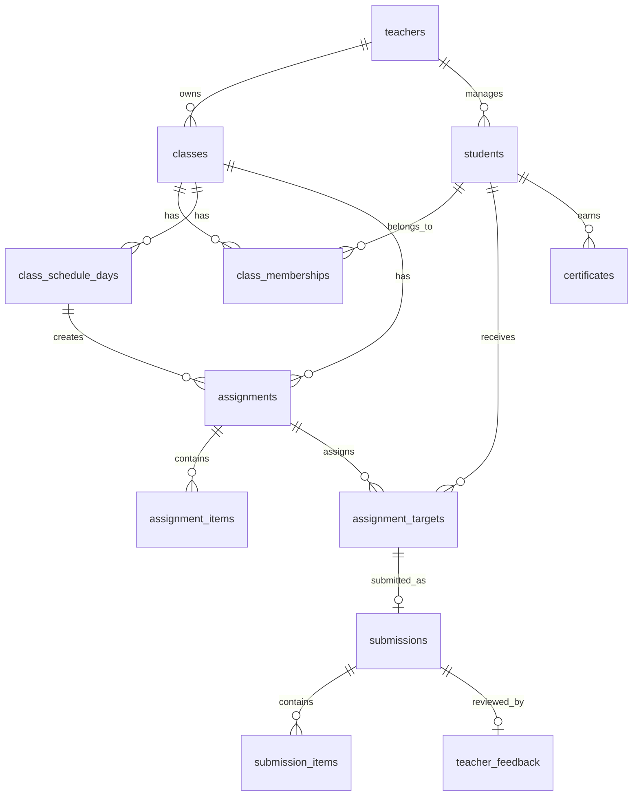

# ERD: Student Homework Management

이 문서는 현재 Next.js 목업을 Supabase로 전환할 때 기준으로 삼을 데이터 모델과 insert 흐름을 정리한다.

참고한 Supabase 공식 문서:
- JavaScript insert: https://supabase.com/docs/reference/javascript/insert
- Storage upload: https://supabase.com/docs/reference/javascript/storage-from-upload

## 설계 원칙

- 화면 컴포넌트는 Supabase SDK를 직접 호출하지 않는다.
- 프론트는 `/api/*` 또는 repository 함수를 호출한다.
- 녹음 파일은 제출 전까지 브라우저 Blob으로만 보관한다.
- 최종 제출 시 서버 API에서 Storage 업로드와 DB insert를 처리한다.
- 캘린더에서 숙제를 만들면 `assignments`, `assignment_items`, `assignment_targets`, `class_schedule_days.homeworkIds`에 해당하는 관계가 함께 생성되어야 한다.
- 여러 테이블을 동시에 쓰는 작업은 클라이언트에서 순차 insert하지 말고 서버 API 또는 Postgres RPC로 묶는다.

## ERD



## Tables

### teachers

Supabase Auth user와 강사 프로필을 연결한다.

| column | type | note |
|---|---|---|
| id | uuid pk | auth.users.id 참조 권장 |
| email | text unique | 로그인 이메일 |
| display_name | text | 강사명 |
| role | text | `teacher`, `admin` |
| created_at | timestamptz | default now() |

### classes

| column | type | note |
|---|---|---|
| id | uuid pk |  |
| teacher_id | uuid fk teachers.id | 소유 강사 |
| name | text | 반 이름 |
| description | text nullable | 반 설명 |
| status | text | `active`, `archived` |
| created_at | timestamptz | default now() |
| updated_at | timestamptz | default now() |

### students

학생 로그인은 초기에는 access code 기반으로 두고, 추후 Auth 계정과 연결할 수 있게 둔다.

| column | type | note |
|---|---|---|
| id | uuid pk |  |
| teacher_id | uuid fk teachers.id | 관리 강사 |
| student_code | text unique | access code 또는 학생 ID |
| name | text | 학생명 |
| school_name | text nullable | 학교 |
| grade | text nullable | 학년 |
| avatar_key | text | 목업/프로필 아이콘 |
| memo | text nullable | 강사용 메모 |
| parent_id | text nullable | 학부모 계정 ID, 후순위 |
| status | text | `active`, `inactive` |
| created_at | timestamptz | default now() |
| updated_at | timestamptz | default now() |

### class_memberships

학생과 반은 다대다 가능성을 열어둔다.

| column | type | note |
|---|---|---|
| id | uuid pk |  |
| class_id | uuid fk classes.id |  |
| student_id | uuid fk students.id |  |
| status | text | `active`, `inactive` |
| created_at | timestamptz | default now() |

Unique:

```sql
unique (class_id, student_id)
```

### class_schedule_days

반 상세 캘린더/진도관리의 날짜 기록이다. 학생에게도 보여줄 수 있는 공개 가능한 정보 중심으로 둔다.

| column | type | note |
|---|---|---|
| id | uuid pk |  |
| class_id | uuid fk classes.id |  |
| date | date | 수업 날짜 |
| has_class | boolean | 수업 있음/없음 |
| start_time | time nullable | 시작 |
| end_time | time nullable | 종료 |
| book_title | text nullable | 교재 |
| progress_title | text nullable | 오늘 진도 |
| progress_memo | text nullable | 수업 내용 |
| next_prep | text nullable | 다음 준비 |
| created_at | timestamptz | default now() |
| updated_at | timestamptz | default now() |

Unique:

```sql
unique (class_id, date)
```

### assignments

캘린더 생성 숙제와 일반 숙제를 모두 담는다.

| column | type | note |
|---|---|---|
| id | uuid pk |  |
| teacher_id | uuid fk teachers.id |  |
| class_id | uuid fk classes.id |  |
| schedule_day_id | uuid fk class_schedule_days.id nullable | 캘린더에서 생성된 경우 |
| title | text | 숙제명 |
| description | text nullable | 학생 안내 |
| assignment_type | text | `listening_recording`, `writing`, `vocabulary`, `general`, `quiz` |
| assigned_date | date | 생성/배정일 |
| due_at | timestamptz nullable | 마감 |
| status | text | `draft`, `published`, `closed`, `archived` |
| created_at | timestamptz | default now() |
| updated_at | timestamptz | default now() |

### assignment_items

숙제 안의 문항 또는 제출 단위다.

| column | type | note |
|---|---|---|
| id | uuid pk |  |
| assignment_id | uuid fk assignments.id |  |
| item_type | text | `listening_recording`, `writing_prompt`, `quiz_question`, `vocabulary` |
| title | text nullable | 문항 제목 |
| prompt_text | text nullable | 지문/문제/라이팅 프롬프트 |
| audio_path | text nullable | Storage path |
| audio_file_name | text nullable | 원본 파일명 |
| order_index | int | 표시 순서 |
| min_recording_sec | int nullable | 녹음형 최소 시간 |
| max_recording_sec | int nullable | 녹음형 최대 시간 |
| created_at | timestamptz | default now() |

### assignment_targets

숙제 배정 대상 학생과 제출 진행 상태다.

| column | type | note |
|---|---|---|
| id | uuid pk |  |
| assignment_id | uuid fk assignments.id |  |
| student_id | uuid fk students.id |  |
| status | text | `assigned`, `submitted`, `late`, `excused` |
| submitted_at | timestamptz nullable | 제출 시각 |
| reviewed_at | timestamptz nullable | 강사 확인 시각 |
| created_at | timestamptz | default now() |
| updated_at | timestamptz | default now() |

Unique:

```sql
unique (assignment_id, student_id)
```

### submissions

학생이 실제 제출한 묶음이다. 한 숙제당 학생 1명의 최종 제출은 1개를 기본으로 둔다.

| column | type | note |
|---|---|---|
| id | uuid pk |  |
| assignment_id | uuid fk assignments.id |  |
| student_id | uuid fk students.id |  |
| target_id | uuid fk assignment_targets.id |  |
| status | text | `submitted`, `reviewed`, `returned` |
| submitted_at | timestamptz | default now() |
| reviewed_at | timestamptz nullable |  |
| created_at | timestamptz | default now() |
| updated_at | timestamptz | default now() |

Unique:

```sql
unique (assignment_id, student_id)
```

### submission_items

녹음 파일, 라이팅 답안, 퀴즈 응답 등 실제 제출 내용이다.

| column | type | note |
|---|---|---|
| id | uuid pk |  |
| submission_id | uuid fk submissions.id |  |
| assignment_item_id | uuid fk assignment_items.id |  |
| text_answer | text nullable | 라이팅/텍스트 제출 |
| file_path | text nullable | Storage path |
| file_name | text nullable | 원본 파일명 |
| mime_type | text nullable | 예: audio/webm |
| duration_sec | int nullable | 녹음 길이 |
| file_size_bytes | bigint nullable |  |
| created_at | timestamptz | default now() |

### teacher_feedback

승인/반려와 피드백을 제출과 분리한다. 피드백은 선택값이다.

| column | type | note |
|---|---|---|
| id | uuid pk |  |
| submission_id | uuid fk submissions.id unique |  |
| teacher_id | uuid fk teachers.id |  |
| decision | text | `approved`, `returned` |
| comment | text nullable | 선택 피드백 |
| created_at | timestamptz | default now() |
| updated_at | timestamptz | default now() |

### certificates

| column | type | note |
|---|---|---|
| id | uuid pk |  |
| student_id | uuid fk students.id |  |
| course_title | text | 과정명 |
| completed_at | date | 수료일 |
| issue_status | text | `not_issued`, `issued` |
| certificate_path | text nullable | Storage path |
| created_at | timestamptz | default now() |

## Storage Buckets

### assignment-audio

원어민 MP3/M4A 파일.

추천 path:

```text
teachers/{teacherId}/classes/{classId}/assignments/{assignmentId}/items/{itemId}/native.{ext}
```

### student-recordings

학생 녹음 제출 파일.

추천 path:

```text
students/{studentId}/assignments/{assignmentId}/items/{assignmentItemId}/{submissionId}.{ext}
```

### certificates

수료증 PDF.

추천 path:

```text
students/{studentId}/certificates/{certificateId}.pdf
```

## Supabase Insert 흐름

Supabase JS의 `.insert()`는 기본적으로 inserted row를 반환하지 않는다. 반환이 필요하면 `.select()`를 체인한다.

```ts
const { data, error } = await supabase
  .from("classes")
  .insert({ teacher_id, name, description, status: "active" })
  .select()
  .single();
```

Storage 파일 업로드는 `.storage.from(bucket).upload(path, fileOrBlob, options)` 형태를 사용한다.

```ts
const { data, error } = await supabase.storage
  .from("student-recordings")
  .upload(path, blob, {
    contentType: blob.type || "audio/webm",
    upsert: false
  });
```

## Insert Case 1: 학생 등록

단순 insert다.

```ts
const { data: student, error } = await supabase
  .from("students")
  .insert({
    teacher_id: teacherId,
    student_code: input.studentCode,
    name: input.name,
    school_name: input.schoolName,
    grade: input.grade,
    avatar_key: input.avatarKey,
    memo: input.memo,
    parent_id: input.parentId,
    status: "active"
  })
  .select()
  .single();
```

반 배정까지 같이 하면 `class_memberships`를 추가 insert한다.

```ts
await supabase.from("class_memberships").insert({
  class_id: input.classId,
  student_id: student.id,
  status: "active"
});
```

## Insert Case 2: 캘린더에서 숙제 생성

필요 작업:

1. `class_schedule_days` upsert
2. `assignments` insert
3. `assignment_items` insert
4. 반 학생 수만큼 `assignment_targets` bulk insert

이 작업은 원자성이 필요하므로 서버 API에서 Postgres RPC를 호출하는 것을 권장한다.

### 권장 RPC 시그니처

```sql
create or replace function create_homework_from_calendar(
  p_teacher_id uuid,
  p_class_id uuid,
  p_schedule_date date,
  p_has_class boolean,
  p_title text,
  p_description text,
  p_assignment_type text,
  p_due_at timestamptz,
  p_item_type text,
  p_prompt_text text,
  p_status text
)
returns uuid
language plpgsql
security definer
as $$
declare
  v_schedule_day_id uuid;
  v_assignment_id uuid;
  v_item_id uuid;
begin
  insert into class_schedule_days (class_id, date, has_class)
  values (p_class_id, p_schedule_date, p_has_class)
  on conflict (class_id, date)
  do update set has_class = excluded.has_class, updated_at = now()
  returning id into v_schedule_day_id;

  insert into assignments (
    teacher_id, class_id, schedule_day_id, title, description,
    assignment_type, assigned_date, due_at, status
  )
  values (
    p_teacher_id, p_class_id, v_schedule_day_id, p_title, p_description,
    p_assignment_type, p_schedule_date, p_due_at, p_status
  )
  returning id into v_assignment_id;

  insert into assignment_items (
    assignment_id, item_type, prompt_text, order_index
  )
  values (
    v_assignment_id, p_item_type, p_prompt_text, 1
  )
  returning id into v_item_id;

  insert into assignment_targets (assignment_id, student_id, status)
  select v_assignment_id, cm.student_id, 'assigned'
  from class_memberships cm
  where cm.class_id = p_class_id
    and cm.status = 'active';

  return v_assignment_id;
end;
$$;
```

서버 API:

```ts
const { data: assignmentId, error } = await supabase.rpc(
  "create_homework_from_calendar",
  {
    p_teacher_id: teacherId,
    p_class_id: classId,
    p_schedule_date: assignedDate,
    p_has_class: true,
    p_title: input.title,
    p_description: input.description,
    p_assignment_type: input.assignmentType,
    p_due_at: input.dueAt,
    p_item_type: input.itemType,
    p_prompt_text: input.promptText,
    p_status: input.status
  }
);
```

원어민 오디오 파일이 있으면 assignment 생성 후 `assignment_items.audio_path`를 update한다.

## Insert Case 3: 학생 녹음 제출

클라이언트는 Blob을 서버 API로 보낸다. 서버 API가 Storage upload와 DB insert를 처리한다.

권장 API:

```text
POST /api/student/submissions
Content-Type: multipart/form-data

assignmentId
assignmentItemId
studentId
durationSec
recordingFile
```

서버 처리 순서:

1. `assignment_targets` 확인
2. `submissions` insert 또는 upsert
3. Storage `student-recordings` 업로드
4. `submission_items` insert
5. `assignment_targets.status = submitted`, `submitted_at = now()` update

예시:

```ts
const { data: submission, error: submissionError } = await supabase
  .from("submissions")
  .insert({
    assignment_id: assignmentId,
    student_id: studentId,
    target_id: targetId,
    status: "submitted"
  })
  .select()
  .single();

const path = `students/${studentId}/assignments/${assignmentId}/items/${assignmentItemId}/${submission.id}.webm`;

const { error: uploadError } = await supabase.storage
  .from("student-recordings")
  .upload(path, recordingBlob, {
    contentType: recordingBlob.type || "audio/webm",
    upsert: false
  });

const { error: itemError } = await supabase
  .from("submission_items")
  .insert({
    submission_id: submission.id,
    assignment_item_id: assignmentItemId,
    file_path: path,
    file_name: "recording.webm",
    mime_type: recordingBlob.type,
    duration_sec: durationSec,
    file_size_bytes: recordingBlob.size
  });

await supabase
  .from("assignment_targets")
  .update({
    status: "submitted",
    submitted_at: new Date().toISOString()
  })
  .eq("id", targetId);
```

이 흐름도 중간 실패 시 정리가 필요하므로 실제 운영에서는 서버 API 내부에서 보상 처리하거나 DB 함수와 Storage 업로드 순서를 명확히 관리한다.

## Insert Case 4: 강사 승인/반려

피드백은 선택값이다.

```ts
const { error } = await supabase
  .from("teacher_feedback")
  .upsert({
    submission_id: submissionId,
    teacher_id: teacherId,
    decision: decision,
    comment: comment || null,
    updated_at: new Date().toISOString()
  }, {
    onConflict: "submission_id"
  });

await supabase
  .from("submissions")
  .update({
    status: decision === "approved" ? "reviewed" : "returned",
    reviewed_at: new Date().toISOString()
  })
  .eq("id", submissionId);

await supabase
  .from("assignment_targets")
  .update({
    reviewed_at: new Date().toISOString()
  })
  .eq("id", targetId);
```

## Query 화면 매핑

### 반 상세 캘린더

```sql
select *
from class_schedule_days
where class_id = :class_id
  and date between :month_start and :month_end
order by date;
```

### 반 숙제 현황

```sql
select
  a.id,
  a.title,
  a.assignment_type,
  a.assigned_date,
  a.due_at,
  a.status,
  count(at.id) as target_count,
  count(at.id) filter (where at.status = 'submitted') as submitted_count
from assignments a
left join assignment_targets at on at.assignment_id = a.id
where a.class_id = :class_id
group by a.id
order by a.assigned_date desc;
```

### 학생관리 학습이력

```sql
select
  a.id,
  a.title,
  c.name as class_name,
  a.assignment_type,
  a.assigned_date,
  at.status,
  at.reviewed_at,
  s.submitted_at
from assignment_targets at
join assignments a on a.id = at.assignment_id
join classes c on c.id = a.class_id
left join submissions s on s.target_id = at.id
where at.student_id = :student_id
order by a.assigned_date desc;
```

## Indexes

```sql
create index idx_classes_teacher_id on classes (teacher_id);
create index idx_students_teacher_id on students (teacher_id);
create index idx_class_memberships_class_id on class_memberships (class_id);
create index idx_class_memberships_student_id on class_memberships (student_id);
create index idx_schedule_days_class_date on class_schedule_days (class_id, date);
create index idx_assignments_class_id on assignments (class_id);
create index idx_assignment_targets_assignment_id on assignment_targets (assignment_id);
create index idx_assignment_targets_student_id on assignment_targets (student_id);
create index idx_submissions_assignment_student on submissions (assignment_id, student_id);
create index idx_submission_items_submission_id on submission_items (submission_id);
```

## RLS 방향

- `teachers`: 본인 row만 select/update.
- `classes`: `teacher_id = auth.uid()`인 강사만 접근.
- `students`: `teacher_id = auth.uid()`인 강사만 관리.
- `class_memberships`: 해당 class의 teacher만 관리.
- `assignments`: 해당 class의 teacher만 관리, 학생은 자신에게 target이 있는 published assignment만 select.
- `assignment_targets`: 강사는 담당 반 target 접근, 학생은 본인 target만 select/update 제한.
- `submissions`: 학생은 본인 submission insert/select, 강사는 담당 반 submission select/update.
- `submission_items`: submission 접근 권한과 동일.
- `teacher_feedback`: 강사는 담당 submission 작성, 학생은 본인 submission feedback select.

## 구현 우선순위

1. `teachers`, `classes`, `students`, `class_memberships`
2. `class_schedule_days`, `assignments`, `assignment_items`, `assignment_targets`
3. 학생 숙제 목록 query
4. `student-recordings` Storage bucket
5. `submissions`, `submission_items`
6. `teacher_feedback`
7. certificates
